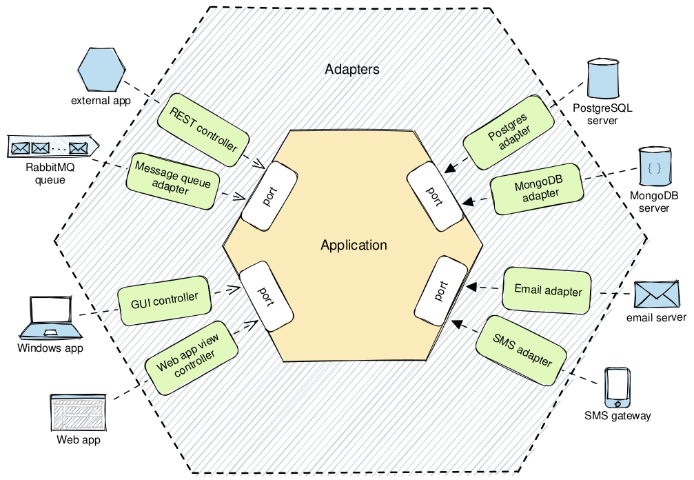

to do list project with Hexagonal architecture and DDD concepts.

### To Run project

`$  docker compose up --build -d  `

- to see the logs of backend:

  - `$ docker logs -f backend`

### To Run tests

`$ docker compose -f docker-compose.yml -f docker-compose.test.yml up -d`

- to see the result:
- `$ docker logs -f backend`

